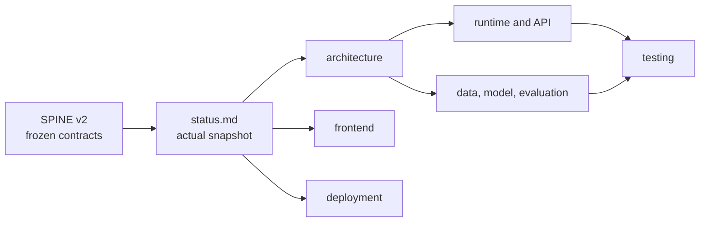

# Demeu documentation

This directory is the entry point for engineers, reviewers, operators, and data
contributors working on Demeu. It describes the implementation at the stated
baseline; it does not replace the frozen product contracts in SPINE.

| Field | Value |
|---|---|
| Updated | 2026-09-28 |
| Implementation baseline | current `main`; exact release SHA is reported by `/api/healthz` |
| Mutable implementation snapshot | [status.md](status.md) |
| Contract canon | SPINE v2 at `/home/almaz/dev/Almaz/Projects/private/demeu/architecture/00-SPINE.md` |
| Repository | `BAITC-Hacks/hack-eb79fd40-specimen-ai`, default branch `main` |

## How the documentation fits together

When SPINE and the code differ, keep the contract unchanged and record the
difference in [Status](status.md#known-contract-and-runtime-divergences).

## Documentation map

| Document | Purpose | Start here when… |
|---|---|---|
| [Documentation index](README.md) | Map, reading paths, and maintenance rules | You are new to the repository |
| [Architecture](architecture.md) | Components, trust boundaries, and inference flow | You need the whole system model |
| [Frontend](frontend.md) | Doctor, patient, and design-system behavior | You change screens or UX copy |
| [Deployment](deployment.md) | Images, ingress, TLS, health, deploy, rollback | You operate the VPS |
| [Astana Hub production](production-astana-hub.md) | Current domain, shared-VPS topology, state and acceptance gates | You operate the current production |
| [Status](status.md) | Evidence-backed mutable snapshot and divergences | You need to know what is true now |
| [API reference](api-reference.md) | HTTP endpoints, payloads, and errors | You build an API client |
| [Runtime services](runtime-services.md) | LLM, rules, model, Telegram, and PDF services | You change backend orchestration |
| [Session lifecycle](session-lifecycle.md) | Tokens, sessions, finalization, and delivery state | You change state transitions |
| [Security and privacy](security-privacy.md) | PII boundaries, threats, and controls | You review exposure or access |
| [Data and ML pipeline](data-ml-pipeline.md) | DDXPlus processing and LR artifact | You train or inspect the model |
| [Evaluation](evaluation.md) | Eval corpus, metrics, and claim rules | You report model quality |
| [Testing](testing.md) | Test layers, commands, and release gates | You verify a change |

All entries above are required documentation. Every relative link in this
index must resolve before a documentation release is accepted.

## Reading paths

### Product or clinical reviewer

1. [Status](status.md#current-snapshot) for the evidence date and limitations.
2. [Architecture](architecture.md#system-boundary) for the human-in-the-loop boundary.
3. [Frontend](frontend.md#patient-screen) for what the patient actually sees.
4. [Evaluation](evaluation.md) for supported quality claims.

### Backend engineer

1. [Architecture](architecture.md#runtime-components).
2. [API reference](api-reference.md).
3. [Runtime services](runtime-services.md).
4. [Session lifecycle](session-lifecycle.md).
5. [Testing](testing.md).

### Frontend engineer or designer

1. [Frontend](frontend.md#screen-map).
2. [API reference](api-reference.md).
3. [Security and privacy](security-privacy.md).
4. [Status](status.md#known-contract-and-runtime-divergences).

### Data or ML engineer

1. [Data and ML pipeline](data-ml-pipeline.md).
2. [Architecture](architecture.md#analysis-pipeline).
3. [Evaluation](evaluation.md).
4. [Testing](testing.md).

### Operator

1. [Deployment](deployment.md#supported-topologies).
2. [Status](status.md#production-evidence).
3. [Security and privacy](security-privacy.md).
4. [Testing](testing.md).

## Sources of truth

| Question | Authority |
|---|---|
| Frozen names, DTOs, invariants, and error codes | SPINE v2 |
| What the current release implements | Repository code plus [status.md](status.md) |
| Production behavior observed at a point in time | Accepted report linked from [status.md](status.md#production-evidence) |
| Published metrics | [`eval/report.json`](../eval/report.json), interpreted by [evaluation.md](evaluation.md) |
| Deployment procedure | [deployment.md](deployment.md) and scripts under [`deploy/`](../deploy/) |

`status.md` is deliberately mutable. Historical planning statements are not
current evidence, and an accepted report is not a perpetual uptime claim.

## Documentation conventions

- Use repository-relative links and name the code file or route that supports a claim.
- Put implementation drift in `status.md`; do not silently rewrite SPINE.
- Mark facts without code, artifact, or accepted-report evidence as **unverified**.
- Never include credentials, patient messages, chat identifiers, or raw PII.
- Product language must say that this is not a diagnosis and the physician decides.
- Metrics in public prose come only from [`eval/report.json`](../eval/report.json).
- Keep “implemented”, “observed in production”, and “planned” visibly separate.

## Updating these docs

1. Record the new baseline and evidence date in [Status](status.md).
2. Update component or flow docs only after the implementation changes.
3. Recheck every relative link, route, environment-variable name, and script name.
4. Run the terminology audit, lint, TypeScript check, and relevant tests.
5. Leave deployment evidence timestamped; do not convert it into a fresh-live claim.
