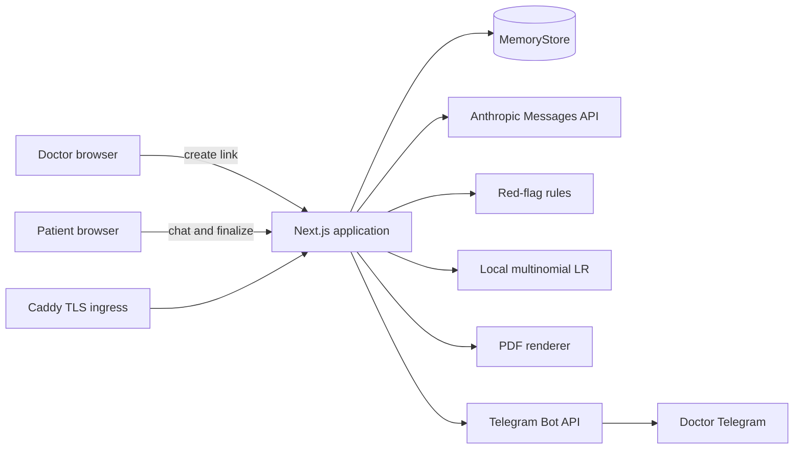
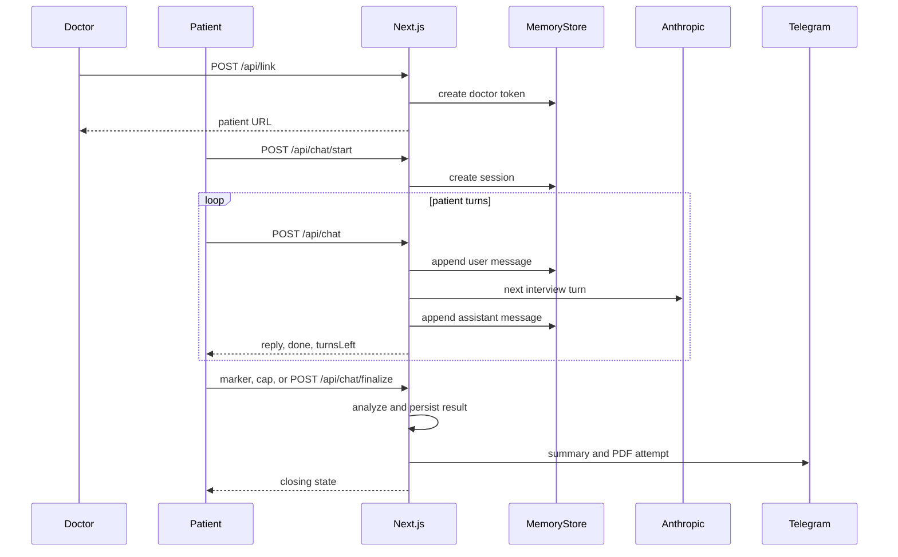
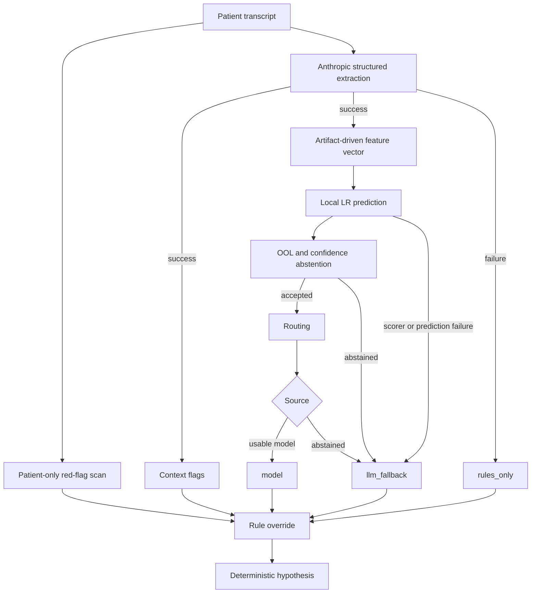

# Architecture

This document describes the components and runtime flow implemented by Demeu.
SPINE remains the frozen contract canon; current differences are tracked in
[Status](status.md#known-contract-and-runtime-divergences).

| Field | Value |
|---|---|
| Updated | 2026-07-17 |
| Baseline | `19aa75528974582de44e5d8b1e7027289776f6e4` |
| Canon | SPINE v2 |
| Related | [Runtime services](runtime-services.md), [Session lifecycle](session-lifecycle.md) |

## System boundary

Demeu collects a structured history, identifies urgent rule signals, ranks
possible conditions with a local model, routes the case to a specialty, and
sends a physician-facing summary. It is decision support: this is not a
diagnosis, and the physician makes the final clinical decision.

Only Caddy is internet-facing in the supported deployment. The Next.js process
contains the UI, API handlers, orchestration, in-memory store, local model
scorer, summary renderer, and delivery adapter.

## Runtime components

| Component | Implementation anchor | Responsibility |
|---|---|---|
| Web runtime | [`app/`](../app/), [`package.json`](../package.json) | Next.js 15.5 App Router on React 19 and TypeScript |
| Dialogue adapter | [`lib/anamnesis.ts`](../lib/anamnesis.ts), [`lib/llm.ts`](../lib/llm.ts) | Patient interview and structured Anthropic calls |
| Structured extraction | [`lib/extract.ts`](../lib/extract.ts) | Transcript to `Anamnesis` and `EvidenceVector` |
| Rule engine | [`lib/redflags.ts`](../lib/redflags.ts) | Quote-based and derived urgent signals |
| Analysis coordinator | [`lib/triage.ts`](../lib/triage.ts) | Sources, abstention, routing, priority, hypothesis |
| Local model | [`lib/model.ts`](../lib/model.ts), [`models/triage-lr-v1.json`](../models/triage-lr-v1.json) | JSON-backed multinomial logistic-regression scoring |
| Session store | [`lib/store.ts`](../lib/store.ts) | Doctor tokens, sessions, results, delivery state in memory |
| Finalization | [`lib/finalize.ts`](../lib/finalize.ts) | Idempotent result creation and notification orchestration |
| Physician output | [`lib/telegram.ts`](../lib/telegram.ts), [`lib/pdf.ts`](../lib/pdf.ts) | Telegram text plus a Cyrillic-capable PDF |
| Edge | [`deploy/`](../deploy/) | Caddy TLS, container lifecycle, smoke, rollback |

## Request flow

The static welcome text is not inserted as the first Anthropic history item;
the model-facing history begins with a user message.

## Analysis pipeline

The implementation keeps rule detection independent of structured extraction,
so urgent patient wording remains available if the external adapter fails.

1. Scan only patient messages with `detectRedFlags(messages)`.
2. Ask Anthropic for structured `Anamnesis` and `EvidenceVector`.
3. Derive context flags from the successful structured result.
4. Build the feature vector from artifact-owned preprocessing and score local LR.
5. Apply out-of-label-space and low-confidence abstention to the prediction.
6. Only for an accepted model result, sum probabilities by specialty and rank routes.
7. Let emergency rules dominate every model-derived priority.
8. Build a deterministic preliminary hypothesis, persist it, and attempt delivery.

## Result sources

| `source` | Model object | Meaning |
|---|---|---|
| `model` | Present | Extraction and model scoring produced a usable result |
| `llm_fallback` | Redacted model after abstention; absent after scorer/prediction failure | Extraction succeeded, but the model result was rejected or could not be produced |
| `rules_only` | Absent | Structured extraction failed; patient-message rules still produced a summary |

The current hypothesis is deterministic, assembled after model/rule resolution.
There is no second post-model Anthropic generation step. This makes the output
repeatable but limits narrative synthesis; see [Status](status.md#known-contract-and-runtime-divergences).

## State and failure boundaries

- `MemoryStore` is process-local. Container recreation loses tokens and sessions.
- Finalization is idempotent for a completed session and stores delivery status.
- Rules use verbatim patient evidence; derived context flags use index `-1`.
- An emergency flag always overrides a lower model priority.
- Anthropic failure can degrade to `rules_only`; it must not silence urgent rules.
- Telegram failure is recorded separately from analytical completion.
- Browser completion is not proof that Telegram delivery succeeded.

## Data and artifact boundary

Python is offline-only. Production reads the committed JSON model artifact,
evidence labels, and routing table. It does **not** read `eval/report.json`;
evaluation is excluded from the runtime dependency set. Feature ordering and
normalization come from the artifact to prevent train/serve skew.

See [Data and ML pipeline](data-ml-pipeline.md) and [Evaluation](evaluation.md).

## Explicit non-goals

- No RAG or runtime ICD search; codes come from the routing table.
- No appointment booking or hospital calendar integration.
- No Postgres or other durable session database in the current deployment.
- No autonomous clinical decision and no patient-visible model ranking.
- No recovery of an in-progress session after a browser reload.

## Invariants to preserve

1. Emergency rules dominate every model output.
2. Quote evidence points to a patient message and remains a literal substring.
3. `model` exists exactly when the local model was evaluated.
4. Every preliminary hypothesis carries the physician-decision disclaimer.
5. A failed adapter still permits `rules_only` finalization and notification.
