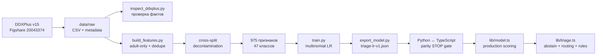

# Данные и ML-пайплайн

> Проверяемый путь DDXPlus от опубликованного релиза до статически встроенного LR-артефакта, включая очистку, parity-гейты и фактическое поведение модели в рантайме.

**Обновлено:** 2026-07-17

**Базовый коммит:** `19aa755`

**Канон контрактов:** SPINE v2; при расхождении ниже отдельно указаны реализация и ожидаемый контракт

**Статус фактов:** [status.md](./status.md)

## Границы документа

Здесь описано то, что воспроизводится из файлов базового коммита. Python используется только офлайн в `scripts/`; production загружает JSON через статические импорты в [`lib/model.ts`](../lib/model.ts) и [`lib/triage.ts`](../lib/triage.ts).

Ни `train_metrics` внутри артефакта, ни результат `mode=no-llm` не являются оценкой сквозного пользовательского пути. Правила публикации метрик находятся в [evaluation.md](./evaluation.md).

## Путь данных



## Провенанс DDXPlus

| Поле | Проверенное значение | Якорь |
|---|---:|---|
| Публикация | Figshare article `20043374`, version `15` | [`data/raw/PROVENANCE.json`](../data/raw/PROVENANCE.json) |
| DOI | `10.6084/m9.figshare.20043374.v15` | [`data/raw/PROVENANCE.json`](../data/raw/PROVENANCE.json) |
| Лицензия | CC BY 4.0 | metadata статьи Figshare, сохранённые в provenance |
| Самостоятельный `LICENSE` в релизе | отсутствует | `license_file_in_release: false` |
| Локальный `data/raw/LICENSE` | запись происхождения лицензии, созданная из metadata | [`data/raw/LICENSE`](../data/raw/LICENSE) |

Важно: локальный файл не следует описывать как файл лицензии, поставленный издателем внутри DDXPlus v15. Источник лицензии — официальные metadata статьи.

DDXPlus содержит синтетических пациентов и опубликован для исследовательского использования. Это ограничение сохраняется при любых локальных метриках.

## Фактический объём и схема

| Срез | Train | Validate | Test |
|---|---:|---:|---:|
| Raw CSV, строк без заголовка | 1 025 602 | 132 448 | 134 529 |
| После adult-only и внутрисплитовой дедупликации | 814 240 | 108 199 | 109 732 |
| После cross-split decontamination | 814 240 | 104 770 | 105 723 |
| Удалено при decontamination | 0 | 3 429 | 4 009 |

Ключ дедупликации и decontamination: `(AGE, SEX, PATHOLOGY, EVIDENCES)`. Приоритет сохранения: `train → validate → test`. После обработки попарные пересечения равны нулю; до неё было 3 429 `train↔validate`, 3 726 `train↔test` и 391 `validate↔test`.

| Свойство релиза | Значение |
|---|---:|
| Evidences | 223: `B=208`, `C=10`, `M=5` |
| One-hot evidence columns | 972 |
| Демографические признаки | `age_norm`, `sex_m`, `sex_f` |
| Полный `feature_order` | 975 |
| Raw pathologies | 49 |
| Непустой `icd10-id` | 49/49 |
| Runtime label space | 47 |
| Шкала severity | 1–5; меньшее значение означает более тяжёлое состояние |

Adult-only фильтр `AGE >= 18` исключил только классы `Bronchiolitis` и `Croup`: в исходных данных их максимальный возраст ниже 18 лет. Поэтому runtime-таблица и артефакт обязаны иметь 47 строк/классов, а не raw-число 49.

Факты очистки и порядок признаков заморожены в [`data/processed/feature_spec.json`](../data/processed/feature_spec.json). Сырые CSV и матрицы `.npz` не входят в production-образ и не должны коммититься.

## Признаки и preprocessing

`feature_order` принадлежит артефакту и является единственным порядком колонок для обучения и serve-time векторизации.

| Поле | Значение |
|---|---:|
| `age_divisor` | `100` |
| `age_missing` | `0.5` |
| `sex_unknown_value` | `0.5` для обеих sex-колонок |
| Возраст вне диапазона | ограничивается диапазоном `0..100`, затем делится на 100 |
| Binary/categorical/multi-choice | активирует ключ `code` либо `code@value` |

Неизвестный ключ не меняет размер вектора: он логируется и остаётся вне `feature_order`. Предварительная санация сопоставленных и несопоставленных evidences выполняется в [`lib/extract.ts`](../lib/extract.ts).

## Production-артефакт

[`models/triage-lr-v1.json`](../models/triage-lr-v1.json) имеет ровно 14 корневых полей, `schema_version=1` и `model_version=lr-v1`.

| Контракт | Фактическое значение |
|---|---:|
| `class_order` | 47 |
| `feature_order` | 975 |
| `weights` | `47 × 975` |
| `bias` | 47 |
| `n_train_rows` | 814 240 |
| `abstain_threshold` | `0.5036984086036682` |

Загрузчик fail-loud проверяет точный набор полей, конечность чисел, размеры матрицы, обязательные демографические признаки, русские подписи и полное соответствие `class_order` таблице патологий.

`train_metrics` входят в технический артефакт для воспроизводимости, но не публикуются как качество продукта. Публичные числа берутся только из [`eval/report.json`](../eval/report.json).

## Словари и маршрутизация

| Артефакт | Содержимое | Статус |
|---|---|---|
| [`data/evidences_ru.json`](../data/evidences_ru.json) | 987 семантических записей + `_meta`; покрывает 223 source codes и 972 evidence features | заморожен; рабочие русские подписи непустые |
| [`data/pathology_map.json`](../data/pathology_map.json) | 47 строк в точном `class_order`, по одной на класс | все `validated: false` |

В таблице маршрутизации 10 строк `emergency`, 18 `urgent`, 12 `planned` и 7 `routine`. Эти значения реализованы, но врачами не валидированы; связанные метрики нельзя представлять как валидированные.

## Parity — стоп-кран интеграции

| Гейт | Набор | Требование | Проверенный результат |
|---|---:|---|---|
| sklearn estimator ↔ экспортированный JSON | 105 723 decontaminated test rows | 0 argmax flips | 0 |
| Python train-time ↔ реальный TypeScript `buildVector`/scorer | 150 held-out rows | все 47 ground-truth и predicted классов, оба пола, B/C/M; 0 argmax и ordered top-3 mismatch | выполнено |

TypeScript-гейт в [`tests/model/parity.test.ts`](../tests/model/parity.test.ts) проверяет:

| Величина | Допуск | Наблюдавшийся максимум |
|---|---:|---:|
| Вектор | `1e-7` | `< 3e-8` |
| Логиты | `1e-7` | `< 3e-8` |
| Вероятности | `1e-9` | `< 4e-10` |

Fixture также привязана SHA-256 к raw test split, артефакту, словарю и `feature_spec`; устаревший hash или перестановка признаков делают тест красным. Красный parity-гейт блокирует интеграцию модели.

Безопасный read-only запуск одного гейта:

```bash
npx vitest run tests/model/parity.test.ts
```

## Фактическое runtime-поведение

Порядок принятия решения в [`lib/triage.ts`](../lib/triage.ts):

1. Считаются только активные недемографические колонки.
2. `out_of_label_space`, если активных колонок меньше двух либо `unmapped / (active + unmapped) > 0.5`.
3. Если OOL не сработал, `low_confidence`, когда максимальная вероятность строго ниже `0.5036984086036682`.
4. При abstain объект `model` и версия сохраняются для аудита, но `pathologies` и `top_contributions` очищаются; `source="llm_fallback"`.
5. При ошибке извлечения возвращается `source="rules_only"` без объекта `model`; regex-красные флаги продолжают работать.
6. При принятой модели берутся top-5 патологий. Вероятности суммируются по основной `specialty`; наружу возвращаются top-3 маршрута. `specialty_alt` используется оценкой, но не production-агрегацией.
7. Срочность — наиболее строгая среди top-5 патологий с `prob >= 0.15`.
8. Emergency-правило всегда доминирует над модельной срочностью.

Fallback-маршрут имеет confidence `0`: для emergency — `скорая/приёмный покой`, иначе — `терапевт`. У `rules_only` routing остаётся пустым.

Explainability рассчитывается для top-1 класса: `weight × value`, со знаком, затем пять вкладов с наибольшим абсолютным значением и русскими подписями. При abstain эти вклады не показываются.

## Покрытие демонстрационных сценариев

| Сценарий | Что доказано на базовом коммите | Ограничение |
|---|---|---|
| Богатый chest/cardiac | 5 сопоставленных evidences; `source=model`; top-1 `Unstable angina`, `0.966944`; вклады доступны | это детерминированная offline-фикстура, а не гарантия любого текста пациента |
| Лёгкий насморк | релиз содержит rhinitis/URTI-кандидатов | one-code fixture имеет высокую top-1 вероятность, но корректно уходит в OOL из-за `<2` активных колонок; точный живой сценарий не доказан |
| Боль в пояснице | прямого класса в 47-class label space нет | одно сопоставленное evidence уходит в OOL; routing должен трактоваться как fallback |

Порог нельзя снижать ради прохождения редкой или короткой демонстрационной реплики: сначала улучшается полнота безопасного извлечения evidences.

## Реализация, SPINE и устаревшие описания

| Тема | Реализация `19aa755` | Как документировать |
|---|---|---|
| OOL ratio | `unmapped / (active + unmapped)` | текстовая формула SPINE расходится; до erratum канонизировать фактический код нельзя молча |
| Гипотеза после модели | отдельного post-model LLM-вызова нет; текст строится до scoring, confidence заменяется top-1 | считать MVP-разрывом с шагом 7 SPINE |
| `symptom.severity` | `number | null` | старое требование non-null устарело относительно принятого runtime-контракта |
| Pathology map | 47 строк | старые упоминания 49 строк относятся к raw label space |
| Статус ML | артефакт, словари и parity реализованы | главы 07–12 с описанием «слоя ещё нет» исторические |

## Воспроизводимые проверки без сети

```bash
# Размеры артефакта и точный threshold
jq '{classes:(.class_order|length),features:(.feature_order|length),weights:[(.weights|length),(.weights[0]|length)],abstain_threshold,preprocessing}' models/triage-lr-v1.json

# Decontamination и нулевые пересечения
jq '{split_rows,decontamination}' data/processed/feature_spec.json

# Таблица должна быть полной и пока невалидированной
jq '{rows:length,validated:([.[].validated]|unique)}' data/pathology_map.json

# Полный parity STOP gate
npx vitest run tests/model/parity.test.ts
```

Полная регенерация изменяет tracked-артефакты и выполняется только осознанно: `build_features.py → train.py → export_model.py → export_parity_fixture.py`, затем Python- и TypeScript-гейты. Внешний LLM для этого пути не нужен.

## Связанные документы

- Поток системы и границы компонентов: [architecture.md](./architecture.md)
- Runtime-аналитика и адаптеры: [runtime-services.md](./runtime-services.md)
- API и жизненный цикл сессии: [api-reference.md](./api-reference.md), [session-lifecycle.md](./session-lifecycle.md)
- Пользовательские состояния: [frontend.md](./frontend.md)
- Деплой и защита данных: [deployment.md](./deployment.md), [security-privacy.md](./security-privacy.md)
- Доказанный статус по коммитам и прогонам: [status.md](./status.md)
