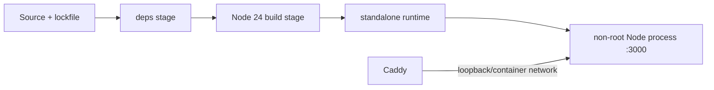

# Deployment

This document describes the supported container and VPS deployment for Demeu.
It separates implementation from timestamped production evidence; current
evidence is recorded in [Status](status.md#production-evidence).

| Field | Value |
|---|---|
| Updated | 2026-07-17 |
| Baseline | `19aa75528974582de44e5d8b1e7027289776f6e4` |
| Canon | SPINE v2 plus accepted deployment evidence |
| Repository | `demeu-ai/demeu`, default branch `main` |

## Container image

The deployment uses a Node.js 24 multi-stage image and Next.js standalone
output. Build dependencies stay in earlier stages; the runtime stage contains
the standalone server, static assets, committed model/data artifacts, and local
font/PDF assets needed at runtime.



The final process runs as a non-root user. Python and raw DDXPlus files are not
part of the production runtime contract.

## Supported topologies

| Branch | Compose/config anchors | Use when |
|---|---|---|
| A: host proxy | [`compose.host-proxy.yml`](../deploy/compose.host-proxy.yml), [`Caddyfile.host.template`](../deploy/Caddyfile.host.template) | Host Caddy owns 80/443; the app has a loopback-only host port |
| B: bundled Caddy | [`compose.caddy.yml`](../deploy/compose.caddy.yml), [`Caddyfile`](../deploy/Caddyfile) | Compose Caddy owns 80/443; the app publishes no host port |

Both branches keep the Next.js application off the public interface. Branch A
uses a loopback application port behind host Caddy. Branch B uses only the
compose network between bundled Caddy and the app, with no host application port.

The nginx template is retained as an operational reference, not the accepted
production ingress for this baseline.

## Production address and TLS

The accepted production report for baseline `19aa755` used the bare-IP origin:

```text
https://109.123.248.16
```

This statement is report-backed as of the date in [Status](status.md), not a
fresh availability claim. The earlier `109-123-248-16.sslip.io` host remains a
rollback alias rather than the current canonical address.

Bare-IP certificates are short-lived and depend on automatic renewal. The IP
configuration in [`Caddyfile.ip`](../deploy/Caddyfile.ip) sets `default_sni` so
clients that omit SNI can still select the IP certificate/site. No-SNI behavior
must remain in smoke coverage; ordinary browser success does not prove it.

## Environment variables

Secrets belong in the VPS environment file and never in git, an image layer,
logs, screenshots, or documentation.

| Variable | Role | Baseline status |
|---|---|---|
| `ANTHROPIC_API_KEY` | Dialogue and structured extraction | Required for live LLM operation |
| `TELEGRAM_BOT_TOKEN` | Telegram Bot API authentication | Required for delivery |
| `TELEGRAM_DOCTOR_CHAT_ID` | Destination for physician summaries | Required for delivery |
| `APP_BASE_URL` | Base used to construct patient links | Must match the selected public origin |
| `NODE_ENV` | Next.js runtime mode | `production` in the container |
| `COMMIT_SHA` | Health/build provenance | Supplied at build/deploy time |
| `DOCTOR_ACCESS_CODE` | Planned `/api/link` protection | Declared but unused by the baseline route |
| `APP_PORT` | Branch A host-side application port | Keep loopback-only; branch B does not publish it |

Do not describe `DOCTOR_ACCESS_CODE` as active protection until the route reads
and validates it. See [Status](status.md#known-contract-and-runtime-divergences).

## Health model

`GET /api/healthz` is the shallow liveness/provenance contract. It reports the
process state, build commit, model version, and whether required configuration
is present without spending an Anthropic request. Поле `processing_mode` точно
показывает `external_llm` или `deterministic`.

The implementation also has an opt-in deep health probe on the same health
surface. Its proof is an HMAC bound to the exact commit. A missing or incorrect
proof returns `404` and makes zero provider calls. An uncached valid probe makes
exactly one structured provider request; a cache and singleflight coalesce
repeated or concurrent probes.

Deep health is additive: it may fail while the shallow process remains alive.
Deploy runs the authenticated deep probe before declaring an external LLM revision green. In
deterministic mode it skips the Anthropic key and provider probe, then requires
a provider-free deep self-test of the fixed questionnaire and three safety scenarios. A
deep failure enters recovery toward the recorded last-green revision rather
than publishing success or creating a dependency-driven restart loop.

| Layer | Purpose | Appropriate consumer |
|---|---|---|
| Shallow | Process, commit, model/config presence | Container and routine liveness |
| Deep | External extraction or deterministic questionnaire readiness | Manual smoke and release verification |

## Deploy flow

[`deploy/deploy.sh`](../deploy/deploy.sh) is fail-closed:

1. Validate required files, environment, selected topology, and expected branch/SHA.
2. Build the multi-stage image with commit provenance.
3. Start or recreate the selected compose stack.
4. Wait for shallow health and compare the returned commit.
5. In external LLM mode, run the commit-bound deep probe before marking the revision green.
6. Recover toward last-green on deep failure and return non-zero on any mismatch.

Use [`DEPLOY.md`](../deploy/DEPLOY.md) for operator commands and
[`TLS.md`](../deploy/TLS.md) for certificate/topology details.

## Rollback flow

[`deploy/rollback.sh`](../deploy/rollback.sh) is also fail-closed. It selects an
explicit prior revision, rebuilds/recreates, and verifies only commit-matched
shallow health before reporting success. Rollback does not run the deep probe
and therefore is not proof that structured extraction is ready. A failed
rollback remains a failure requiring operator action.

The `sslip.io` configuration is an address rollback option, while source rollback
selects a prior commit. They solve different failures and should not be conflated.

## Smoke levels

| Script | Coverage |
|---|---|
| [`smoke-l1.sh`](../deploy/smoke-l1.sh) | TLS, shallow health, link creation, invalid token, page reachability |
| [`smoke-scenario1-once.sh`](../deploy/smoke-scenario1-once.sh) | One live urgent scenario with explicit safeguards |
| [`smoke-scenarios.sh`](../deploy/smoke-scenarios.sh) | Broader scenario runner |
| [`smoke.mjs`](../deploy/smoke.mjs) | HTTP orchestration used by smoke scripts |

Live smoke can consume external API quota and send Telegram messages. Run it
deliberately and never print credentials or patient-identifying content.

## Persistence and rollout consequences

Sessions and doctor tokens live in `MemoryStore`. Any process restart, container
recreation, deploy, or rollback loses active sessions and invalidates generated
links. Schedule rollout with that consequence visible to operators and demo users.

There is no CI/CD workflow in this baseline. Deployment and rollback are
operator-invoked scripts; repository `main` does not deploy itself.

## Operator checklist

1. Confirm the intended revision and read [Status](status.md).
2. Confirm secrets exist without printing them.
3. Select exactly one Caddy topology and confirm ports 80/443 ownership.
4. Set `APP_BASE_URL` to bare IP or the deliberate rollback alias.
5. Run deploy and require commit-matched shallow health.
6. Run TLS/no-SNI and deep smoke at the appropriate risk level.
7. Confirm delivery independently from browser completion.
8. Record a new timestamped report; do not overwrite historical evidence.
