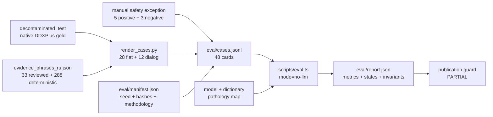

# Оценка качества

> Правила чтения и публикации `eval/report.json`: состав набора, режим прогона, статусы метрик, ограничения и воспроизводимость.

**Обновлено:** 2026-07-17

**Базовый коммит:** `19aa755`

**Канонический отчёт:** [`eval/report.json`](../eval/report.json)

**Канон контрактов:** SPINE v2; фактические отклонения перечислены отдельно

## Главное ограничение

Текущий отчёт получен в `mode=no-llm` при идеальном извлечении структурированных признаков. Он проверяет production TypeScript-путь модели, abstain, маршрутизации, правил и инвариантов после точки извлечения.

**Запрещено представлять 100% pathology-метрики этого режима как chat E2E, качество LLM-извлечения, клиническую эффективность или качество на реальных пациентах.** Сквозное качество может быть ниже.

`readme_guard.status` равен `PARTIAL`: это явный статус пригодности публикации с обязательными caveats, а не «полностью валидировано».

## Источники и поток



| Артефакт | Назначение |
|---|---|
| [`eval/cases.jsonl`](../eval/cases.jsonl) | замороженные карточки оценки |
| [`eval/manifest.json`](../eval/manifest.json) | seed, выборка, методология, зависимости и hashes |
| [`scripts/render_cases.py`](../scripts/render_cases.py) | детерминированный renderer DDXPlus-карточек |
| [`scripts/eval.ts`](../scripts/eval.ts) | фактический TypeScript evaluator |
| [`eval/report.json`](../eval/report.json) | единственный источник публикуемых чисел |
| [`eval/report.md`](../eval/report.md) | человекочитаемый рендер JSON-отчёта |

## Состав 48 карточек

| Поднабор | Количество | Источник gold |
|---|---:|---|
| Flat DDXPlus | 28 | held-out DDXPlus |
| Dialog DDXPlus | 12 | те же структурированные held-out данные, механически превращённые в диалог |
| Pathology gold всего | 40 | 40 разных классов decontaminated test split |
| Manual safety positive | 5 | явное исключение главы 09 |
| Manual safety negative | 3 | явное исключение главы 09 |
| Всего | 48 | 40 DDXPlus + 8 safety |

Нативный gold DDXPlus: pathology, differential и weights, evidences, age, sex, initial evidence. Routing, urgency и table-derived emergency не являются нативными medical labels: они выводятся через [`data/pathology_map.json`](../data/pathology_map.json).

Текущий manifest использует 321 выбранный phrase key:

| Происхождение phrase | Количество | Что означает |
|---|---:|---|
| `manual_reviewed` | 33 | ограниченная ручная вычитка формулировки |
| `deterministic_generator` | 288 | механическая генерация |
| Всего | 321 | покрытие карточек, не врачебная валидация |

LLM не использовался для генерации или разметки этих карточек. Ручная разметка case-level ограничена восемью safety-карточками.

## Режим прогона

В текущей реализации поддержан только `no-llm`; full/live mode отключён. Для 40 DDXPlus-карточек evaluator подставляет идеальный `EvidenceVector`, затем вызывает те же `buildVector`, scorer, abstain и routing, что production-код.

Следствия:

- pathology top-1/top-3 — верхняя граница после идеального извлечения;
- extraction precision/recall/F1 не запускались и должны оставаться `null/not_run`;
- safety-карточки проверяют детерминированные красные флаги;
- результат не измеряет chat UX, сетевые ошибки, provider latency, delivery в Telegram или PDF;
- отсутствие abstain на этих 40 карточках не доказывает отсутствие abstain на свободном тексте.

## Метрики из текущего отчёта

### Измеренные

| Метрика | Результат | Статус | Допустимое описание |
|---|---:|---|---|
| Pathology top-1 | 40/40, 100% | `measured` | только `no-llm`, ideal extraction |
| Pathology top-3 | 40/40, 100% | `measured` | только `no-llm`, ideal extraction |
| Coverage-adjusted top-1 | 40/40, 100% | `measured` | рядом с abstain/rules-only rates |
| Abstain rate | 0/40, 0% | `measured` | только на выбранных DDXPlus cards |
| Rules-only rate | 0/40, 0% | `measured` | только на выбранных DDXPlus cards |
| Emergency recall, manual | 5/5, 100% | `measured` | manual safety set P |
| Emergency precision, manual | 5/5, 100% | `measured` | manual P/N safety cards |
| Emergency specificity, manual | 3/3, 100% | `measured` | manual safety set N |

### Рассчитанные по невалидированной таблице

Все строки ниже имеют состояние `UNVALIDATED`, потому что 47/47 строк pathology map имеют `validated: false`.

| Метрика | Результат | Почему нельзя повышать статус |
|---|---:|---|
| Routing top-1 strict | 40/40 | specialty получена из невалидированной таблицы |
| Routing top-3 strict | 40/40 | то же |
| Routing top-3 differential | 40/40 | то же |
| Urgency accuracy | 39/40, 97.5% | urgency получена из той же таблицы |
| Under-triage rate | 0/40, 0% | table-derived reference |
| Emergency recall, table-derived DDX | 7/7, 100% | table-derived reference |

Число может быть рассчитано корректно и одновременно оставаться непригодным для утверждения без пометки `UNVALIDATED`.

### Не запускались

| Группа | Поля | Статус |
|---|---|---|
| Flat extraction | precision, recall, F1 | `null`, `not_run` |
| Dialog extraction | precision, recall, F1 | `null`, `not_run` |

Причина во всех случаях: actual LLM extraction не участвовал в `mode=no-llm`. Нулём эти поля заменять нельзя.

## Инварианты и publication guard

Отчёт содержит зелёные `I1`, `I2`, `I2b`, `I3`, `I4`, `I5`, `I6`, `I7`; `invariants.all_passed=true`. Проверки выполняются по каждому результату и охватывают доминирование emergency, проверяемость evidence, контракт модели/abstain, disclaimer, конечные вероятности и согласованность routing/source.

Зелёные инварианты доказывают соблюдение контракта на наборе, но не заменяют независимую оценку качества разметки или реальный E2E.

`readme_guard`:

- разрешает только measured pathology/coverage/abstain/rules-only и manual safety metrics;
- блокирует table-derived routing/urgency metrics;
- требует точный `mode=no-llm`;
- связывает report с cases, manifest, evaluator, model, dictionary и pathology map hashes;
- остаётся `PARTIAL`, пока caveats обязательны.

## Правило публикации

Любая опубликованная метрика должна содержать одновременно:

1. имя метрики;
2. numerator/denominator, а не только процент;
3. `mode=no-llm`;
4. формулировку «при идеальном извлечении»;
5. состояние `measured`, `UNVALIDATED` или `not_run`;
6. дату и базовый коммит/`run_id`;
7. caveat о невалидированной pathology map, если метрика от неё зависит.

Нельзя:

- брать публичные числа из `models/triage-lr-v1.json.train_metrics`;
- превращать `null/not_run` в 0%;
- скрывать abstain и rules-only denominators;
- называть `UNVALIDATED` результат валидированным;
- переносить 100% из ideal-extraction режима на LLM, chat, delivery или реальных пациентов;
- смешивать результаты разных commits или manifest hashes.

## Провенанс коммита

Текущий report содержит:

| Поле | Значение | Правильная трактовка |
|---|---|---|
| `run_id` | `no-llm-6642581bd716b170` | детерминированная привязка к hashes зависимостей |
| `commit` | `6f54902` | source HEAD во время генерации отчёта |
| Документируемый baseline | `19aa755` | коммит, на котором артефакт принят и перепроверяется |

Поле `commit` не является runtime commit развернутого сервиса и не должно использоваться для утверждения, что конкретный production-контейнер обслуживал этот eval. Для runtime-провенанса нужен отдельный commit-bound health/deployment evidence; см. [status.md](./status.md) и [deployment.md](./deployment.md).

## Воспроизведение без provider-вызовов

Read-only drift-check замороженного отчёта:

```bash
npm run eval -- --allow-unvalidated --check
```

На exact baseline `19aa755` эта команда **ожидаемо завершается с exit 1**: tracked report сохраняет `commit=6f54902`, evaluator формирует ожидаемое представление с текущим `19aa755` и выполняет точное byte-сравнение. Это stale commit provenance, а не зелёный reproducibility-check и не свидетельство изменения самих опубликованных метрик.

`--allow-unvalidated` не меняет статус таблицы. Запуск без `--check` перезаписывает `eval/report.json` и `eval/report.md`, обновляя commit/provenance; такую регенерацию делают только осознанно и затем повторно принимают artifact snapshot. До этого публичные числа остаются замороженным snapshot текущего tracked report со всеми его mode/status/caveats.

Короткая проверка статусов:

```bash
jq '{run_id,commit,mode,n,metric_status,invariants,readme_guard}' eval/report.json
jq '.dependencies.evidence_phrases' eval/manifest.json
```

## Реализация, SPINE и устаревшие описания

| Тема | Реализация `19aa755` | Статус документации |
|---|---|---|
| Eval mode | только `no-llm` | планы full/live mode не реализованы |
| OOB set | отдельного набора и отдельной OOB-метрики нет | требование главы 09 остаётся будущей работой |
| Baselines | отдельных baseline-моделей в report нет | нельзя заявлять сравнение с baseline |
| OOB cardinality | нет гарантии «3 случая на метрику» | старый план не описывает текущий artifact |
| Phrase provenance | 33 manual + 288 deterministic | старое 17/304 устарело |
| Report commit | source HEAD генерации | не runtime deployment identity |

## Связанные документы

- Данные, артефакт и parity: [data-ml-pipeline.md](./data-ml-pipeline.md)
- Архитектурный поток: [architecture.md](./architecture.md)
- Runtime и API: [runtime-services.md](./runtime-services.md), [api-reference.md](./api-reference.md)
- Сессия и frontend: [session-lifecycle.md](./session-lifecycle.md), [frontend.md](./frontend.md)
- Тестовая матрица: [testing.md](./testing.md)
- Деплой, privacy и evidence ledger: [deployment.md](./deployment.md), [security-privacy.md](./security-privacy.md), [status.md](./status.md)
