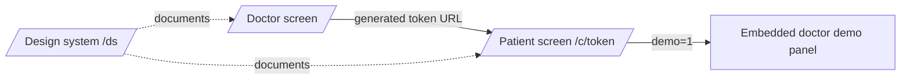

# Frontend

This document describes the three browser surfaces and their implemented UX
boundaries. API contracts are documented separately in [API reference](api-reference.md).

| Field | Value |
|---|---|
| Updated | 2026-07-17 |
| Baseline | `19aa75528974582de44e5d8b1e7027289776f6e4` |
| Canon | SPINE v2 plus [Status](status.md) for implementation drift |
| Anchors | [`app/page.tsx`](../app/page.tsx), [`app/c/[token]/`](../app/c/%5Btoken%5D/), [`app/ds/page.tsx`](../app/ds/page.tsx) |

## Screen map

| Route | Audience | Main job |
|---|---|---|
| `/` | Doctor or demo operator | Generate and copy a patient link |
| `/c/[token]` | Patient | Complete the interview and explicitly finalize if needed |
| `/c/[token]?demo=1` | Demo operator | Show the doctor-facing result panel beside the patient flow |
| `/ds` | Designers and developers | Inspect colors, type, controls, and clinical-state examples |

## Doctor screen

[`app/page.tsx`](../app/page.tsx) requests a doctor token from `/api/link`, builds
the patient URL from the configured application base, and exposes copy/open
actions. Its visible states are intentionally small:

1. Ready to generate.
2. Generating.
3. Link generated.
4. Copy succeeded.
5. Recoverable request or clipboard error.

A generated URL is backed by a reusable doctor token. The current one-patient
wording can imply that a token is single-use, but the backend accepts multiple
sessions for it. Treat the link as reusable until token semantics change.

## Patient screen

[`app/c/[token]/page.tsx`](../app/c/%5Btoken%5D/page.tsx) owns the network and
conversation state. [`patient-components.tsx`](../app/c/%5Btoken%5D/patient-components.tsx)
renders the shell, composer, banners, progress, and finish affordances.

The state model is roughly fifteen user-visible conditions rather than one
generic loading flag:

| Area | States |
|---|---|
| Bootstrap | idle, starting, invalid link, start failure |
| Conversation | ready, sending, assistant pending, turn accepted |
| Input | free text, heuristic choice chips, heuristic numeric control, disabled |
| Completion | finalizing, completed routine, completed emergency |
| Failure | turn failure, finalize failure, client timeout |

Exact state helpers live in [`lib/patient-state.ts`](../lib/patient-state.ts).
The patient sees a safe closing experience; model rankings and physician detail
are not rendered in the default patient view.

## Input widgets are heuristic

[`lib/input-widget.ts`](../lib/input-widget.ts) infers a suitable input from the
assistant text. It may show chips or a numeric control when wording resembles a
known question; otherwise it falls back to free text.

- The widget is presentation logic, not a structured dialogue protocol.
- A chip click sends ordinary text through the same chat endpoint.
- Unexpected wording or Kazakh phrasing can fall back to free text.
- Backend validation and clinical extraction cannot rely on a widget having appeared.

## Language boundary

Static navigation and patient-shell strings have Russian and Kazakh variants
through [`lib/i18n.ts`](../lib/i18n.ts). The current clinical layer remains
Russian-first: prompts, evidence labels, routing labels, and evaluated fixtures
are primarily Russian.

Do not claim equal analytical quality for Kazakh. A Kazakh UI selection improves
the interaction language, but it is not evidence of equivalent extraction,
red-flag, or model coverage.

## Result visibility

On finalization, the HTTP response can contain the full `TriageResult`. The
default patient UI hides it, while `?demo=1` renders the result through
[`DoctorPanel.tsx`](../app/c/%5Btoken%5D/DoctorPanel.tsx).

This is a known MVP privacy boundary: hidden UI is not data minimization. The
payload remains visible in browser developer tools. See
[Security and privacy](security-privacy.md) and [Status](status.md#known-contract-and-runtime-divergences).

## Completion and delivery semantics

Completion may be triggered by the dialogue marker, hard turn cap, or explicit
finish action. The patient can receive a completed browser state after the
analysis is stored, but that state must not be worded as proof that Telegram and
PDF delivery have already succeeded.

Delivery has independent `pending`, `sent`, and `failed` state. The current UI
does not poll that state, so “sent to the doctor” is an optimistic claim unless
the server response explicitly establishes it.

## Timeout and recovery limits

- The browser request timeout is shorter than the backend's complete LLM retry allowance.
- A client timeout can therefore coexist with continued backend work.
- Retrying finalization is safe only because server finalization is idempotent.
- Reloading the page does not restore the current `sessionId` or transcript.
- There is no `GET` endpoint that reconstructs an in-progress patient session.
- A reload means starting a new interview from the reusable token.

## Error surfaces

[`error.tsx`](../app/c/%5Btoken%5D/error.tsx) is the route-level fallback. Local
screen states distinguish invalid tokens, transient network errors, finalization
errors, and completed sessions. Preserve server error codes internally, but do
not expose stack traces or patient data in visible errors.

Emergency UI must never wait for model confidence. It follows the rule-derived
result and presents immediate action guidance without presenting model detail.

## Design system and fonts

[`app/globals.css`](../app/globals.css) defines the shared tokens and responsive
layout. [`app/ds/page.tsx`](../app/ds/page.tsx) is a living inventory, not a
separate component package.

The interface uses local Lora and IBM-family font assets. Fonts are served by
the application rather than fetched from a third-party font CDN, avoiding a
runtime dependency and an extra browser data disclosure.

## Accessibility and responsive behavior

- Keep labels visible; placeholders are not labels.
- Announce sending, errors, and completion through appropriate live regions.
- Preserve keyboard access for chips, finish, copy, and language controls.
- Do not encode urgency only by color.
- Keep the composer usable on narrow mobile viewports and with the keyboard open.
- Treat the design-system route as examples, not proof of full accessibility coverage.

## Frontend change checklist

1. Test `/`, `/c/[token]`, `/c/[token]?demo=1`, and `/ds`.
2. Exercise Russian and Kazakh shell strings plus free-text fallback.
3. Verify every loading, timeout, error, emergency, and completion state.
4. Confirm the normal patient screen still hides physician/model detail.
5. Recheck copy around reusable links and asynchronous delivery.
6. Run the browser and contract slices listed in [Testing](testing.md).
